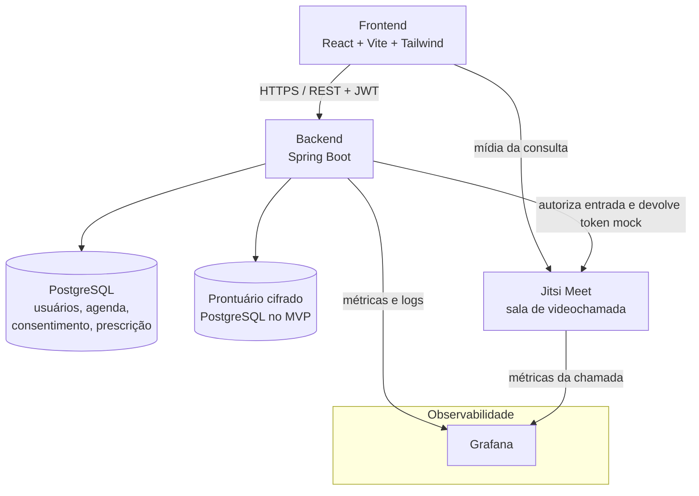
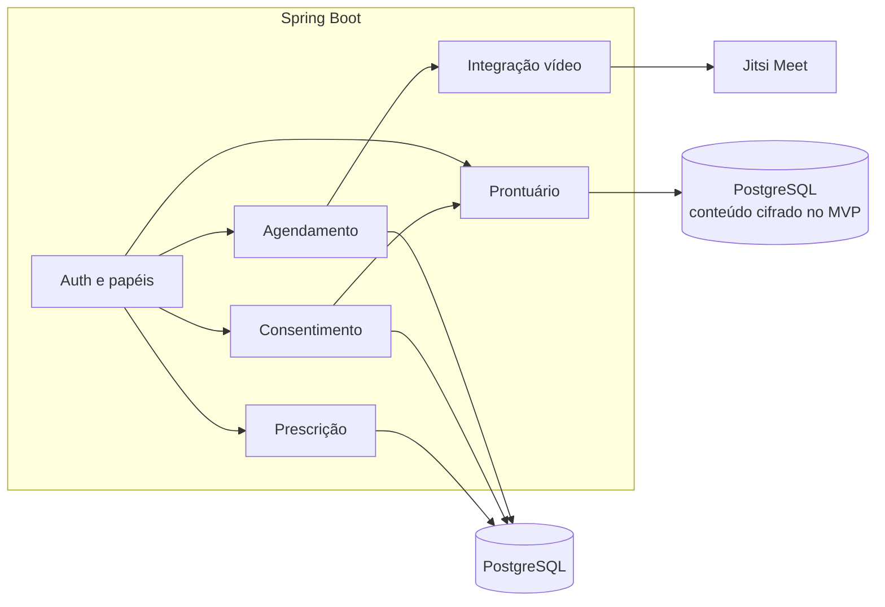
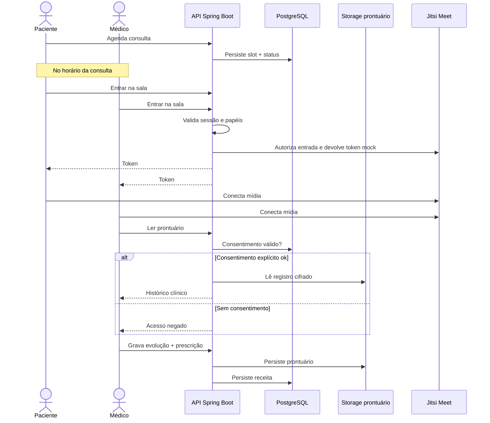

# Vida Conecta

Plataforma que conecta **pacientes** a **médicos** por consulta em vídeo, com histórico clínico compartilhado entre profissionais — apenas com **consentimento explícito** do paciente.

Aplicação **pequena**: um backend monolítico modular, um frontend web e integração com o Jitsi Meet para vídeo em tempo real **desacoplado**.

---

## Contexto do negócio

Pacientes agendam consultas, realizam videochamada com o médico, consultam o próprio prontuário e recebem prescrição digital. Médicos acessam o histórico clínico compartilhado somente quando o paciente autoriza.

### Escopo

| Módulo | O que faz |
| --- | --- |
| Agendamento | Paciente escolhe médico, data e horário; confirma ou cancela consulta |
| Videochamada | Consulta ao vivo funcional com Jitsi Meet; o backend usa token mock apenas para autorizar a entrada na sala |
| Prontuário eletrônico | Registro clínico cifrado no PostgreSQL no MVP; storage separado é a arquitetura-alvo |
| Prescrição digital | Receita gerada pelo médico e disponibilizada ao paciente |

### Fora de escopo (Entregas futuras)

Fila de espera, validação de cadastro por e-mail, laudos de imagem, integração com farmácias e app mobile.

---

## Restrição especial — LGPD

Dados de saúde são **dados sensíveis**. A plataforma precisa de:

- **Controle de acesso rígido** — autenticação, papéis (paciente, médico, admin) e autorização por consulta/consentimento
- **Criptografia em trânsito** — TLS em todas as APIs e no sinalização/mídia da videochamada
- **Criptografia em repouso** — banco transacional e storage do prontuário cifrados
- **Consentimento explícito** — o paciente autoriza, por médico ou por consulta, o compartilhamento do histórico; sem consentimento válido, o médico não lê o prontuário de outro profissional

---

## SLA desejado

| Indicador | Meta |
| --- | --- |
| Disponibilidade da plataforma | **99.9%** (~8,7 h de downtime/ano) |
| Taxa de queda da videochamada | **≤ 1%** (meta operacional para o Jitsi Meet) |

Uso distribuído no dia comercial, com picos no **almoço** e no **fim da tarde**. A videochamada escala de forma independente (serviço de mídia separado).

---

## Arquitetura

Monólito modular no Spring Boot: um único deploy, módulos internos (agendamento, prontuário, prescrição, consentimento, auth). O Jitsi Meet transporta a mídia da consulta; o backend autoriza a entrada por meio de um token mock e registra os eventos da sessão.

### Visão geral

O frontend fala com o **backend** (API de negócio) e incorpora o Jitsi Meet na tela da consulta. Banco e prontuário só o backend acessa. **Grafana** concentra métricas e logs.

### Módulos do backend

### Fluxo de uma consulta

## Stack

| Camada | Tecnologia |
| --- | --- |
| Frontend | React, Vite, Tailwind CSS |
| Backend | Java, Spring Boot |
| Banco transacional | PostgreSQL |
| Prontuário | PostgreSQL com conteúdo cifrado no MVP; storage separado previsto para evolução |
| Vídeo | Jitsi Meet (mídia WebRTC; self-hosted ou serviço público) |
| Nuvem | AWS (HTTPS, criptografia em repouso, backups) |
| Código | GitHub | Observabilidade com Grafana

---

## Segurança (mínimo viável LGPD)

- HTTPS em toda comunicação;
- Senhas com hash (bcrypt/argon2); sessão JWT de curta duração
- RBAC: paciente só vê os próprios dados; médico só vê o que o consentimento cobre
- Consentimento versionado (quem, o quê, até quando, revogação)
- Auditoria de acesso ao prontuário (quem leu, quando, em qual consulta)
- Segredos fora do código (variáveis de ambiente / secret manager)
- Minimização: o Jitsi Meet **não** persiste conteúdo clínico da consulta
- Anonimização dos dados pessoais(dica do professor a melhorar)

---

## Disponibilidade e picos

- Meta 99.9%: health check da API, restart automático, banco com backup e restauração testada
- Vídeo em serviço separado para o pico de almoço/fim de tarde não derrubar agendamento nem prontuário
- Observação da taxa de queda da chamada para manter ≤ 1%

---

## Disciplinas mais críticas neste projeto

- [ ] Ecossistemas de Startups
- [x] Direito Digital e LGPD
- [x] Fundamentos de Engenharia de Software
- [x] Metodologias Ágeis em Gestão de Projetos
- [ ] Desenvolvimento de Software Integrado – DevOps
- [ ] Design da Experiência do Usuário
- [x] Controle de Versão e Gerenciamento de Configuração
- [ ] Gerenciamento de Produtos
- [x] Integração e Entrega Contínua
- [x] Orquestração de Contêineres e Gerenciamento de Cluster
- [ ] Infraestrutura Automatizada
- [x] Desenvolvimento de Software Seguro – DevSecOps
- [x] Testes Automatizados e Contínuos
- [x] Arquitetura de Microsserviços e Escalabilidade
- [x] Documentação Técnica
- [x] Computação em Nuvem
- [ ] Computação sem Servidores
- [x] Monitoramento e Análise de Logs
- [x] Tópicos Avançados em Engenharia de Software

### Plano de Desenvolvimento

- Planejamento;
- CI/MVP;
- CD/Observabilidade;
- Plano de Testes e de escala.

### Links projetos

#### Frontend
https://github.com/iagobcosta/vida-conecta-frontend

#### Backend
https://github.com/iagobcosta/vida-conecta-backend
